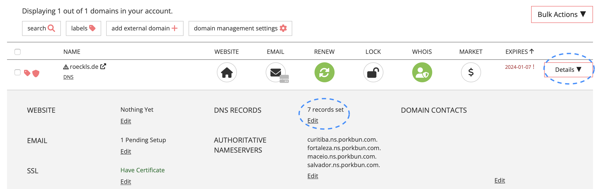

In my first blog post ['My new Gatsby Blog with Quality built-in'](/my-new-gatsby-blog-with-quality-built-in) I explained how I've set up my new blog with Gatsby.
After I finished the setup, the next question arose:
_Where shall I host it?_

Shall I order a new web space or even set up an own web server?
... no, too much effort! I want to focus on writing - not on maintainance!

I've already had the idea to open-source my blog and obviously the best platform to share code open-source is [Github](https://github.com).
So why not trying out [Github Pages](https://pages.github.com) which a platform to host static content from a Github repository.

## Create a Github repo

To deploy my already existing Gatsby setup to Github Pages, first, I had to create a new repository in my Github account.
Simply, click on the _+_ icon in the top right and press _New repository_.


It is mandatory that the repository name starts with your Github username - in my case: _mroeckl.github.io_


I usually use _master_ instead of _main_ as the default branch which can be configured in the _Settings_ of a repository.


## Push source code to Github

Then, I configured my local Gatsby repository to use my new Github repository as origin and pushed my master branch to the Github origin.

```
git remote add origin https://github.com/mroeckl/mroeckl.github.io.git
git branch --set-upstream-to=origin/master master
git push origin master
```

Now all the source code is stored in the new repository on Github.

## Build Gatsby with Github Actions

As a next step we have to build the source code.
Building is pretty convenient on Github with [Github Actions](https://github.com/features/actions).
Let's click on _Actions_ and _New workflow_ to create a new build and deployment workflow.


Thanks to Github, packaging a Gatsby site is super easy.
There is already a fully fledged workflow for building and deploying Gatsby ready to be used by us.
Seach for 'Gatsby' and you will find the following workflow:


By pressing _Configure_ the workflow file, which will be stores later under `.github/workflows/` in your repository, gets visible.
Besides the actual build and deployment configuration the _on_ field in the beginning of the file defines the triggers on which the workflow will run later on.
By default, it is triggered on every commit on master or manually.
For [Continuous Delivery](https://continuousdelivery.com) this is exactly what we need.
Every commit on master gets built, tested and deployed fully automatically.

Let's give the file a nicer name like `build-deploy.yml`, commit it to the repository by pressing first _'Start Commit'_ and then _'Commit new file'_ on the right and you are done.


After the commit our new workflow automatically starts to run and our Gatsby site gets built and deployed.


Afterwards we can already access it under _mroeckl.github.io_.
If you like to have a custom domain name, a simple and cheap domain service is provided by [Porkbun](https://porkbun.com) which I used in my setup.

## Connect domain to Github

After registering a domain at Porkbun, simply press on _Details_ on the right side of your domain in the _Domain Management_ administration frontend.
Click on _Edit_ next to the _DNS RECORDS_ to create a new subdomain.



In the popup, you will find a section for _Quick DNS Config_.
Select _GitHub_ and confirm the popup.


In the _Host_ text box you can set your preferred subdomain name for your blog.
In the _Answer_ text box replace _USERNAME_ by your Github username.


## Set your custom domain in Github

Finally, we have to tell Github that our page shall be accessible via the newly generated domain name.
Go to _Settings_ in your Github repository and select _Pages_ in the menu on the left.


Scroll down to the section _Custom domain_, enter your fully qualified domain name in the text box and press _Save_.


After some minutes your Gatsby site is accessible via the new domain name.

You should also enforce HTTPS.
Thus, select the checkbox _Enforce HTTPS_.

Awesome, my Gatsby site is live, accessible via Github Pages through my custom domain and every commit on the master branch gets automatically built, tested and deployed. Hurray!

## Links

- [Porkbun: How to connect your domain to Github Pages](https://kb.porkbun.com/article/64-how-to-connect-your-domain-to-github-pages)
- [My new Gatsby Blog with Quality built-in](/my-new-gatsby-blog-with-quality-built-in)

## Photos

- Photo by [Aaron Burden](https://unsplash.com/@aaronburden?utm_source=unsplash&utm_medium=referral&utm_content=creditCopyText) on [Unsplash](https://unsplash.com/photos/cmIqkMPfpMQ?utm_source=unsplash&utm_medium=referral&utm_content=creditCopyText)
