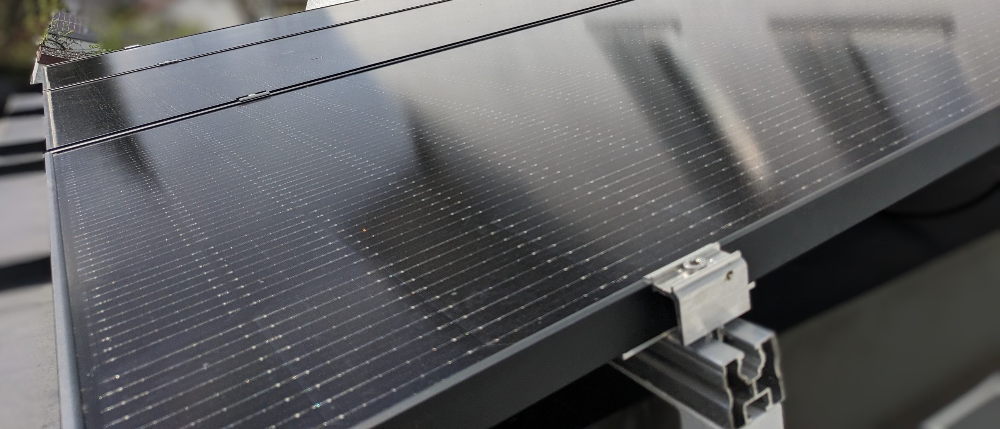

Der Bericht [_Mehr als 300.000 Balkonkraftwerke liefern Strom_](https://www.golem.de/news/bundesnetzagentur-mehr-als-300-000-balkonkraftwerke-liefern-strom-2310-178186.html) auf Golem, über den ich kürzlich gestolpert bin, hat mein Interesse an den Daten des [Marktstammdatenregisters](https://www.marktstammdatenregister.de/MaStR/Einheit/Einheiten/OeffentlicheEinheitenuebersicht) geweckt.

Unter anderem hat mich interessiert, wie viele Balkonkraftwerke in meiner Gemeinde bisher registriert wurden und auch wie groß die jährliche Steigerung ist.
Das Marktstammdatenregister bietet eine API an, über die man mit verschiedenen Filtern die registrierten Anlagen abrufen kann.
Die empfangenen Daten habe ich in einem Balkendiagramm visualisiert.

Wollt ihr es selbst ausprobieren?
Dann gebt einfach im Eingabefeld eine Gemeinde ein.
Daraufhin stellt das Diagramm die absolute Anzahl der registrierten Balkonkraftwerke dieser Gemeinde zum Stichtag 31. Dezember der Jahre 2021, 2022 und 2023 dar.
Zusätzlich könnt ihr euch auch noch die Summe aller Wechselrichterleistungen und Modulleistungen einblenden lassen.
Viel Spaß damit!

import BalconysolarStats from "./BalconysolarStats";

<BalconysolarStats />

Hier noch ein paar interessante Erkenntnisse:

- Dieses Jahr wurden in Deutschland durchschnittlich ca. 750 neue Balkonkraftwerke pro Tag registriert.
- Das bedeutet, dass im Schnitt alle 2 Minuten ein neues Balkonkraftwerk angemeldet wird.
- Hält dieser Trend weiter an, so sind am 31. Dezember ca. 340 000 Balkonkraftwerke in Deutschland registriert.
- Damit besitzt nahezu jeder hunderste Haushalt ein Balkonkraftwerk.
- In 2023 hat sich die Anzahl der Balkonkraftwerke mehr als vervierfacht.
- Ein durchschnittliches Balkonkraftwerk hat eine Modulleistung von 733 Wp und eine Wechselrichterleistung von 572 W.

---

Links:

- [Filter](<(http://www.marktstammdatenregister.de/MaStR/Einheit/Einheiten/ErweiterteOeffentlicheEinheitenuebersicht?filter=Inbetriebnahmedatum%20der%20Einheit~lt~%2731.12.2023%27~and~Lage%20der%20Einheit~eq~%272961%27~and~Betriebs-Status~eq~%2735%27~and~Nettonennleistung%20der%20Einheit~lt~%270.601%27)>), der ausschließlich sich in Betrieb befindende Balkonkraftwerke mit einer Wechselrichterleistung kleiner 601 Watt im Marktstammdatenregister anzeigt
- Wer wissen möchte, wie dieser Beitrag im Sourcecode aussieht, besucht einfach [github:mroeckl/mroeckl.github.io](https://github.com/mroeckl/mroeckl.github.io/tree/master/content/posts/2023/10/06)
- [Buy me a coffee](https://www.buymeacoffee.com/mroeckl)
