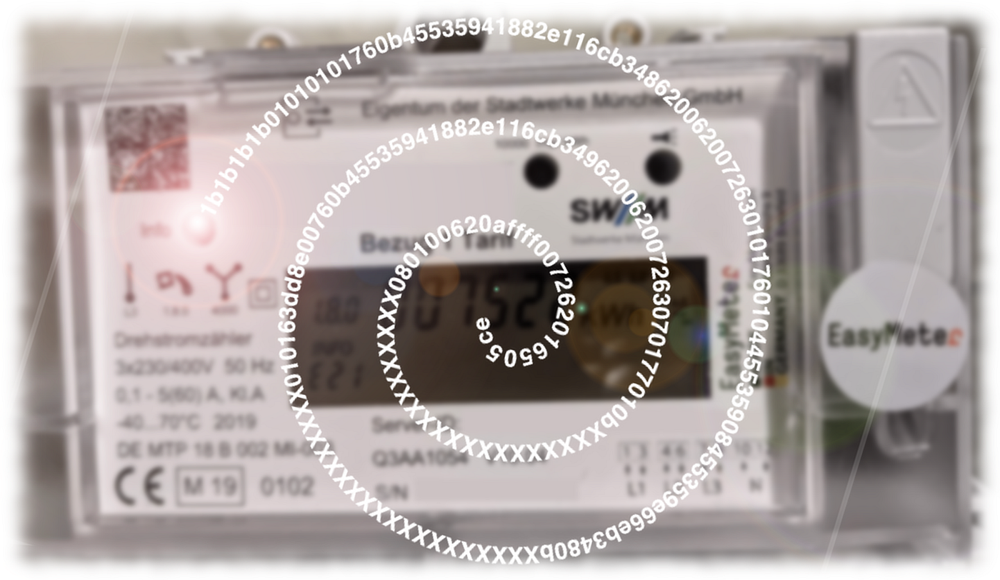
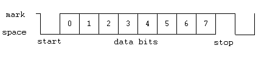

Neue elektronische Stromzähler besitzen optische Schnittstellen, die über Lichtsignale interessante Informationen bereitstellen. Die Betriebsanleitung unseres Stromzählers _Easymeter Q3A_ verweist auf ein so genanntes SML-Protokoll, mit dem die Daten auf den optischen Schnittstellen kodiert sind.

SML-Protokoll? Nie davon gehört. Mal sehen, was die Internetrecherche ergibt und ob wir die nachfolgende Nachricht unseres Stromzählers entschlüsseln können.



## Smart Message Language (SML)

SML steht für _Smart Message Language_ und ist ein Kommunikationsprotokoll für Geräte wie Stromzähler oder Wärmemengenzähler. Es ist in [BSI TR-03109-1](https://www.bsi.bund.de/SharedDocs/Downloads/DE/BSI/Publikationen/TechnischeRichtlinien/TR03109/TR-03109-1_Anlage_Feinspezifikation_Drahtgebundene_LMN-Schnittstelle_Teilb.pdf?__blob=publicationFile) spezifiziert.

Um die im Bild oben dargestellte Botschaft zu dekodieren, muss man eigentlich nur ein paar wenige Details zu SML kennen. Zuallererst die Definition einer SML-Nachricht:

```
SML_Message ::= SEQUENCE {
  transactionId   Octet String,   # Korrelations-ID für Request-Response-Paare
  groupNo   Unsigned8,            # Nachrichtengruppen
  abortOnError   Unsigned8,       # Fehlerverhalten
  messageBody   SML_MessageBody,  # Eigentlicher Nachrichteninhalt
  crc16   Unsigned16,             # Prüfsumme
  endOfSmlMsg   EndOfSmlMsg       # Nachrichtenende immer 00
}
```

In der SML-Nachricht ist in erster Linie der _messageBody_ von Interesse:

```
SML_MessageBody ::= CHOICE {
  OpenResponse  [0x00000101] SML_PublicOpen.Res     # Eröffnungsnachricht
  GetListResponse [0x00000701] SML_GetList.Res      # Messwertliste
  CloseResponse [0x00000201] SML_PublicClose.Res    # Schlussnachricht
...
```

Eine _OpenResponse_ wird zu Beginn gesendet und enthält lediglich einige Metadaten, die für uns vorerst nur zweitrangig sind. Danach folgt eine _GetListResponse_ mit den eigentlich interessanten Messwerten und zum Schluss folgt eine _CloseResponse_, die lediglich eine globale Signatur enthält und daher nachfolgend nicht weiter erläutert wird.

Die Definition der GetListResponse, in der die Messwerte und andere Datensätze enthalten sind, lautet:

```
SML_GetList.Res ::= SEQUENCE {
  clientId Octet String OPTIONAL,       # ID des anfragenden Clients
  serverId Octet String,                # ID des Stromzählers (Server)
  listName Octet String OPTIONAL,       # Name der Liste
  actSensorTime SML_Time OPTIONAL,      # Aktuelle Zeit des Messgeräts
  valList SML_List,                     # Liste der Datensätze
  listSignature SML_Signature OPTIONAL, # Signatur
  actGatewayTime SML_Time OPTIONAL      # Aktuelle Zeit des Gateways
}
```

Die Messwerte befinden sich im Feld _valList_. Die Einträge der _valList_ sind wie folgt kodiert:

```
SML_ListEntry ::= SEQUENCE {
  objName Octet String,                  # Name des Datensatzes nach OBIS
  status SML_Status OPTIONAL,            # Status
  valTime SML_Time OPTIONAL,             # Zeitpunkt der Datenerhebung
  unit SML_Unit OPTIONAL,                # Einheit des Datensatzes nach DLMS
  scaler Integer8 OPTIONAL,              # Skalar (value*10^scaler)
  value SML_Value,                       # Wert des Datensatzes
  valueSignature SML_Signature OPTIONAL  # Signatur
}
```

## SML-Binärkodierung

Und zuallerletzt müssen wir uns noch die Kodierung der Datenelemente genauer ansehen. In der Binärkodierung beginnt jedes Datenelement mit einem so genannten _Type-Length (TL)_ Feld. Das erste Halbbyte (Nibble) definiert in der Regel den Datentyp, z.B. 5 für _Integer_. Und das zweite Nibble definiert die Byte-Anzahl (inkl. dem Byte für das TL-Feld). Die Dezimalzahl 256 würde somit durch _53 01 00_ als _Integer16_ kodiert.

```
53 01 00
|| |   |--> Least Significant Byte (Big Endian)
|| |--> Most Significant Byte (Big Endian)
||
||--> Länge = 3 Byte (1 Byte für das TL-Feld und 2 Byte für den Datenwert)
|
|--> Datentyp (5=Integer)
```

Liste weiterer relevanter TL-Felder:

- _0x00-0x0E_ : Octet String
- _0x42_ : Boolean
- _0x52, 0x53, 0x55, 0x59_ : Integer8, Integer16, Integer32, Integer64
- _0x62, 0x63, 0x65, 0x69_ : Unsigned8, Unsigned16, Unsigned32, Unsigned64
- _0x7z_ : Liste mit _z_ Elementen

Soweit so gut. Aber was bedeuten die sich wiederholenden Zeichen _1b1b.._ und _0101.._ zu Beginn der Übertragung? Es scheint also noch ein Transportprotokoll zu geben, in dem die SML-Nachrichten verpackt werden. Auch dazu gibt es ein Kapitel in der Spezifikation.

## SML-Transportprotokoll und serielle Übertragung

Beginn und Ende einer Übertragungseinheit werden durch die Escape-Sequenz _1b 1b 1b 1b_ im Datenstrom eingeleitet. Danach folgt bei Version 1:

- _01 01 01 01_ für den Beginn einer Nachricht und
- _1a XX YY YY_ für das Ende einer Nachricht (XX=Anzahl der Füll-Bytes, YY YY = Prüfsumme)

Auf der optischen Schnittstelle werden die Daten mittels serieller Kommunikation mit 8N1 (8 Datenbits, kein Paritätsbit und 1 Stopbit) und 9600 Baud übertragen.



<center>8N1 Serielle Übertragung [[Source]](https://commons.wikimedia.org/wiki/File:Rs232_8n1_%281%29.png)</center>

## OBIS

Zu guter Letzt müssen wir uns noch einen weiteren Standard ansehen. _OBIS (Object Identification System)_ definiert eindeutige Identifikationsnummern für Messwerte wie Zählerstände.

OBIS-IDs unseres Stromzählers sind unter anderem:

- 1-0:**1.8.0**: Positive Gesamtwirkenergie [Wh] = Zählerstand
- 1-0:**16.7.0**: Aktuelle Gesamtwirkleistung [W] = Aktueller Verbrauch
- 10:**52.7.0**: Aktuelle Spannung (U) auf Phase L2 [V]

Alle OBIS-IDs sind nach dem folgenden Muster aufgebaut:

_A-B:C.D.E_ wobei:

- A das Medium (1=Elektrizität, 7=Gas, 8=Wasser, …),
- B den Kanal (falls relevant),
- C die Messgröße (Energie, Spannung, Temperatur, …),
- D die Messart (Aktuell, Maximum, …) und
- E die Tarifstufe (0=Total, 1=Tarif1, 2=Tarif2, …)

Eine ausgiebige Liste an OBIS-Codes könnt ihr hier finden: [IEC62056 OBIS](https://www.promotic.eu/en/pmdoc/Subsystems/Comm/PmDrivers/IEC62056_OBIS.htm).

## Dekodierung der Beispielnachricht

Und das ist auch schon alles, was man wissen muss, um die Beispielnachricht aus dem Bild am Artikelanfang entschlüsseln zu können:

```
1b 1b 1b 1b                               # Escape-Sequenz
01 01 01 01                               # Beginn der Nachricht
76                                        # StartSMLMessage (Nachricht 1/3)
  0b 45 53 59 41 88 2e 11 6c b3 48        #   transactionId
  62 00                                   #   groupNo (not set)
  62 00                                   #   abortOnError (no error)
  72                                      #   messageBody (Liste)
    63 01 01                              #     OpenResponse (01 01)
    76                                    #     Payload (Liste)
      01                                  #       codepage
      04 45 53 59                         #       clientId
      08 45 53 59 e6 6e b3 48             #       reqFileId
      0b XX XX XX XX XX XX XX XX XX XX    #       serverId (*)
      01                                  #       refTime (secIndex)
      01                                  #       smlVersion
  63 dd 8e                                #   crc16
  00                                      #   EndOfSmlMsg
76                                        # StartSMLMessage (Nachricht 2/3)
  0b 45 53 59 41 88 2e 11 6c b3 49        #   transactionId
  62 00                                   #   groupNo (not set)
  62 00                                   #   abortOnError (no error)
  72                                      #   messageBody (Liste)
    63 07 01                              #     GetListResponse (07 01)
    77                                    #       Payload (Liste)
      01                                  #       clientId
      0b XX XX XX XX XX XX XX XX XX XX    #       serverId (*)
      08 01 00 62 0a ff ff 00             #       listName
      72                                  #       actSensorTime (Liste)
        62 01                             #         secIndex
        65 05 ce e6 6e                    #         97445486 Sek seit Einbau
      74                                  #       valList
        77                                #         1. OBIS Nachricht
          07 81 81 c7 82 03 ff            #           objName=Hersteller-ID
          01                              #           status
          01                              #           valTime
          01                              #           unit
          01                              #           scaler
          04 45 53 59                     #           value='ESY' (Easymeter)
          01                              #           valueSignature
        77                                #         2. OBIS Nachricht
          07 01 00 00 00 09 ff            #           objName=serverId (OBIS 1-0:0.0.9)
          01                              #           status
          01                              #           valTime
          01                              #           unit
          01                              #           scaler
          0b XX XX XX XX XX XX XX XX XX XX#           value (*)
          01                              #           valueSignature
        77                                #         3. OBIS Nachricht
          07 01 00 01 08 00 ff            #           objName=Zählerstand (OBIS 1-0:1.8.0)
          64 00 00 80                     #           status=??
          01                              #           valTime
          62 1e                           #           unit=Wattstunden (DLMS 30)
          52 03                           #           scaler=3 (value*10^3)
          59 00 00 00 00 00 00 22 a0      #           value=8864
          01                              #           valueSignature
        77                                #         4. OBIS Nachricht
          07 81 81 c7 f0 06 ff            #           objName=Konfiguration
          01                              #           status
          01                              #           valTime
          01                              #           unit
          01                              #           scaler
          04 31 07 0e                     #           value (Konfig der Herstellers)
          01                              #           valueSignature
      01                                  #       listSignature
      01                                  #       actGatewayTime
  63 0d b1                                #   crc16
  00                                      #   EndOfSmlMsg
76                                        # StartSMLMessage (Nachricht 3/3)
  0b 45 53 59 41 88 2e 11 6c b3 4a        #   transactionId
  62 00                                   #   groupNo (not set)
  62 00                                   #   abortOnError (no error)
  72                                      #   messageBody (Liste)
    63 02 01                              #     CloseResponse (02 01)
    71                                    #     Payload
      01                                  #       globalSignature
  63 71 b7                                #   crc16
  00                                      # EndOfSmlMsg
00                                        # Füll-Byte
00                                        # Füll-Byte
1b 1b 1b 1b                               # Escape-Sequenz
1a                                        # Ende der Nachricht
02                                        # Anzahl der Füll-Bytes
29 10                                     # Prüfsumme
```

Zusammenfassend sind in dieser Übertragungseinheit 3 SML-Nachrichten enthalten:

1. _OpenResponse_ (01 01)
1. _GetListResponse_ (07 01)
   1. Hersteller-ID = ESY
   1. Server-ID = XX XX XX XX XX XX XX XX XX XX
   1. Zählerstand = 8864 kWh
   1. Konfiguration = 31070E ([Konfigurations-Matrix](https://www.easymeter.com/products/zaehler/q3a#!#config) des Stromzählers)
1. _CloseResponse_ (02 01)

Die _GetListResponse_ ist auch auf der Herstellerseite exakt so beschrieben:


<center>https://www.easymeter.com/products/zaehler/q3a#!#config</center>

## Ausblick

Aber warum interessiert uns das alles? Grundsätzlich ist es natürlich interessant, wie viel Leistung aktuell bezogen wird und wie viel Energie über einen Zeitraum hinweg verbraucht wurde.

Hat man eine PV-Anlage und kennt den aktuellen Bezug, so können Verbraucher wie Spül- oder Waschmaschinen genau dann eingeschaltet werden, wenn durch die PV-Anlage abzüglich der Basislast (Router, Kühlschrank, …) genug Leistung zur Verfügung steht.

Des Weiteren kann der aktuelle Bezug für eine bedarfsgerechte Be-/Entladung eines Batteriespeichers eingesetzt werden. Mit einer cleveren Steuerung liefert der Batteriespeicher nur genau die Leistung, die aktuell von dem Verbrauchern im Haus benötigt werden, damit die Energie nicht unnötig ins öffentliche Stromnetz eingespeist wird.

---

## Links

- [BSI TR-03109–1](https://www.bsi.bund.de/SharedDocs/Downloads/DE/BSI/Publikationen/TechnischeRichtlinien/TR03109/TR-03109-1_Anlage_Feinspezifikation_Drahtgebundene_LMN-Schnittstelle_Teilb.pdf?__blob=publicationFile)
- [Device Language Message Specification (DLMS)](https://www.dlms.com/files/Blue-Book-Ed-122-Excerpt.pdf)
- [https://wiki.volkszaehler.org/software/sml](https://wiki.volkszaehler.org/software/sml)
- [https://www.msxfaq.de/sonst/bastelbude/smartmeter_d0_sml_protokoll.htm](https://www.msxfaq.de/sonst/bastelbude/smartmeter_d0_sml_protokoll.htm)
- [https://www.stefan-weigert.de/php_loader/sml.php](https://www.stefan-weigert.de/php_loader/sml.php)
- [Buy me a coffee](https://www.buymeacoffee.com/mroeckl)

\*) Unsere _serverId_ haben wir unkenntlich gemacht.
