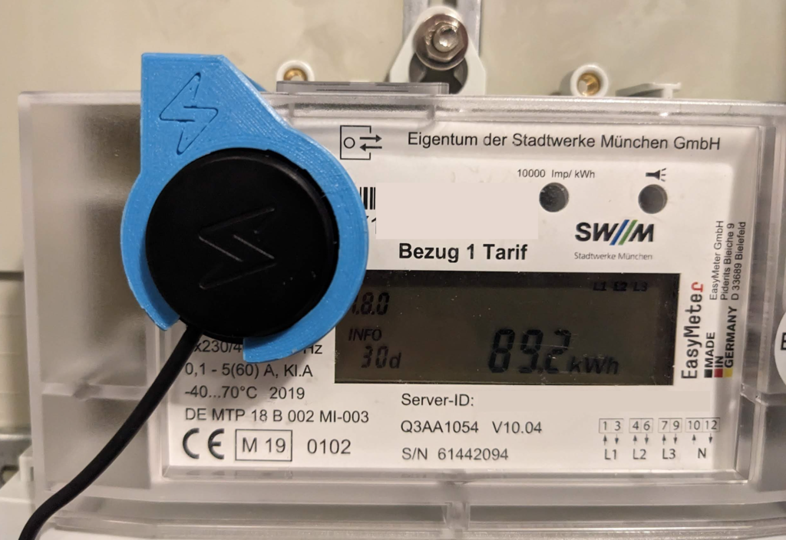

Den [Tibber](https://invite.tibber.com/q9rztnrz) Pulse mit unserem Stromzähler zu nutzen, war nicht ganz einfach.
In diesem Blogpost werde ich daher meine Erfahrungen mit euch teilen.

## Tibber Pulse IR

Um stündliche dynamische Stromtarife, beispielsweise von [Tibber](https://invite.tibber.com/q9rztnrz), nutzen zu können, muss der Stromanbieter stündlich über den Stromverbrauch informiert werden.
Da man ungern jede Stunde den Stromzähler ablesen möchte, braucht man entweder einen Smartmeter oder aber ein Erweiterung für den Stromzähler wie den Tibber Pulse IR.

Der Tibber Pulse besteht aus dem schwarzen batteriebetriebenen Lesekopf (Tracker), den man am Stromzähler montiert, und der dazugehörigen Bridge, die man in die Steckdose steckt.
Tracker und Bridge kommunizieren über das 868 MHz ISM Band, das eine höhere Reichweite als WLAN hat.
Somit kann der Tracker im Keller am Stromzähler über 868 MHz zur Bridge in der Wohnung kommunizieren.
Die Bridge ist dann im häuslichen WLAN eingebunden und sendet die Daten zu Tibber.

### Montage

Für die Montage am Stromzähler muss der Tracker auf einer der Infrarotschnittstellen montiert werden.
Unser Stromzähler, der Easymeter Q3A, hat 4 Infrarot-Datenschnittstellen (DSS):

- Impuls-DSS mit 10.000 Imp/kWh (vorne Mitte)
- Unidirektionale Info-DSS (vorne links)
- Bidirektionale MSB-DSS (MSB=Messstellenbetreiber) (oben)
- Optischer Taster zur Eingabe (vorne rechts)

Der Tracker kann nicht auf der Impuls-DSS verwendet werden, da er nur Daten, die in der so genannten _[Smart Meter Language](./hore-was-dein-stromzahler-dir-zu-sagen-hat-smart-message-language)_ kodiert sind, verstehen kann.
SML wird auf der Info-DSS und MSB-DSS eingesetzt.
Vorzugsweise wird der Tracker oben auf der MSB-DSS montiert.
Jedoch wurde diese Schnittstelle von manchen Messstellenbetreibern mit einem Aufkleber versiegelt.
Laut unseres Messstellenbetreibers darf die Versiegelung nicht entfernt werden.
Daher haben wir anstatt der MSB-DSS die Info-DSS auf der Vorderseite verwendet.

Wer Zugang zu einem 3D-Drucker hat, kann sich meine Halterung für den Easymeter Q3A auf [Thingiverse](https://www.thingiverse.com/thing:6083117) herunterladen.

### Erweiterter Datensatz

Doch leider hat das bei uns noch nicht ausgereicht.
Denn im normalen Modus liefert der Stromzähler nur wenige Datensätze an der Info-DSS:

1. Hersteller-Identifikation ('ESY' für Easymeter)
1. ID des Stromzählers (Server-ID, z.B. '00 11 22 33 44 55 66 77 88 99')
1. Zählerstand in kWh ohne Nachkommastellen
1. Aktuelle Programmierung des Stromzählers (z.B. '[31070E](https://www.easymeter.com/products/zaehler/q3a#!#config)')

Leider ist der Zählerstand ohne Nachkommastellen für einen dynamischen Stromtarif nicht ausreichend.
Es ist aber möglich, ein erweitertes Ausgabeformat auf der Info-DSS zu aktivieren.
Dazu muss man den 4-stelligen PIN des Stromzählers eingeben.
Diesen kann man beim Messstellenbetreiber erfragen.
Der PIN wird über den optischen Taster eingegeben.
Hierzu reicht es, mit einer starken Taschenlampe (400 Lux) auf die rechte Infrarotschnittstelle zu leuchten.
Zweimaliges Blinken startet die PIN-Eingabe.
Dann muss man beispielsweise 5 Mal blinken, um die erste Ziffer 5 einzugeben.
Danach ca. 3 Sekunden warten und dann die nächste Ziffer einblinken.

Nachdem man den PIN erfolgreich eingegeben hat, sollte der erweiterte Datensatz an der Info-DSS anliegen, der dann neben zusätzlichen Daten den Zählerstand in Wh ausgibt.
Der Tracker müsste jetzt funktionieren.
Leider verlässt der Stromzähler nach 120 Sekunden Inaktivität den erweiterten Modus und dann wird wieder nur der reduzierte Datensatz auf der Info-DSS ausgegeben.
Je nach Konfiguration des Stromzählers kann man dieses Verhalten im Menü mittels des optischen Tasters ausschalten.
Leider wurde mittels der Konfiguration [31070E](https://www.easymeter.com/products/zaehler/q3a#!#config) (siehe oben) unseres Stromzählers diese Funktion deaktiviert.

Dadurch blieb nur noch eine Möglichkeit.
Ich musste verhindern, dass nach 120 Sekunden Inaktivität der Stromzähler den erweiterten Modus verlässt.
Das gelang mir, indem ich eine kleine Schaltung aus einem ESP8266, einer IR-Diode und einem Widerstand, die ich noch zuhause hatte, bastelte, die alle 10 Sekunden den optischen Aufruftaster "drückt" und somit eine Aktivität vorgaukelt.

Um die Schaltung nachzubauen, findet ihr alle Infos auf [Thingiverse](https://www.thingiverse.com/thing:6083115) bzw. [Github](https://github.com/mroeckl/easymeter-session-extender).

### Einrichtung

Der Tibber Pulse wird über die Tibber App eingerichtet.
Das hat bei mir auf Anhieb geklappt.
Probleme kann es aber bei der Ausrichtung des Trackers am Stromzähler geben, wenn dieser nicht ganz exakt auf der IR-Diode angebracht ist.
Für die bessere Ausrichtung habe ich die interne Debugging-Oberfläche genutzt.
Dafür müsst ihr einfach die Bridge abstecken und erneut einstecken.
Daraufhin leuchtet sie grün und ein WLAN Access Point namens 'Tibber Bridge' wird geöffnet.
Zum Verbinden mit Handy oder Laptop braucht ihr ein Passwort.
Es ist die Zeichenkette _XXXX-XXXX_ (inkl. dem Minuszeichen), die auf der Bridge aufgeklebt ist.

Wenn ihr dann die URL [http://10.133.70.1](http://10.133.70.1) im Browser öffnet und als Nutzername _admin_ und das obige Passwort eingebt, erscheint die Debugging-Oberfläche.

Auf der Startseite seht ihr die wichtigsten Status-Informationen.
Unter _PARAMS_ könnt ihr den Wert _webserver_force_enable bool[1]_ auf _true_ setzen, damit ihr auch im normalen Modus (ohne Access-Point) auf die Debugging-Oberfläche zugreifen könnt.
Und unter _NODES_ seht ihr bei _Last data_, wann der Tracker die letzten Daten eures Stromzählers auslesen konnte.
Dieser Wert sollte sich in etwa alle 5 Sekunden auf 0 zurücksetzen.
Dauert das Zurücksetzen länger an, so sitzt der Tracker vermutlich nicht richtig auf dem Stromzähler.

Die Lösung läuft bei mir jetzt seit einigen Monaten problemlos und ich hoffe, ich kann mit diesem Blogpost dem ein oder anderen helfen, ähnliche Probleme zu lösen. Viel Erfolg!

---

Links:

- https://blog.wyraz.de/allgemein/a-brief-analysis-of-the-tibber-pulse-bridge/
- [Smart Meter Language](./hore-was-dein-stromzahler-dir-zu-sagen-hat-smart-message-language)
- [Bedienungsanleitung des Easymeter Q3A V10.04](https://www.easymeter.com/downloads/products/zaehler/Q3A1004/BA_Easymeter_Q3A_Rev_13_2019-05-20.pdf)
- Wer wissen möchte, wie dieser Beitrag im Sourcecode aussieht, besucht einfach [github:mroeckl/mroeckl.github.io](https://github.com/mroeckl/mroeckl.github.io/tree/master/content/posts/2023/10/25)
- [Buy me a coffee](https://www.buymeacoffee.com/mroeckl)
