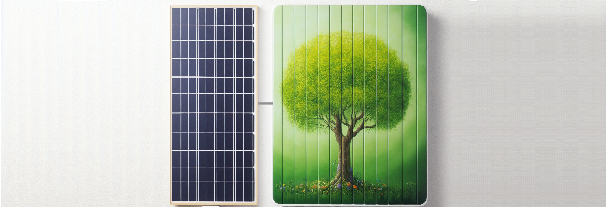
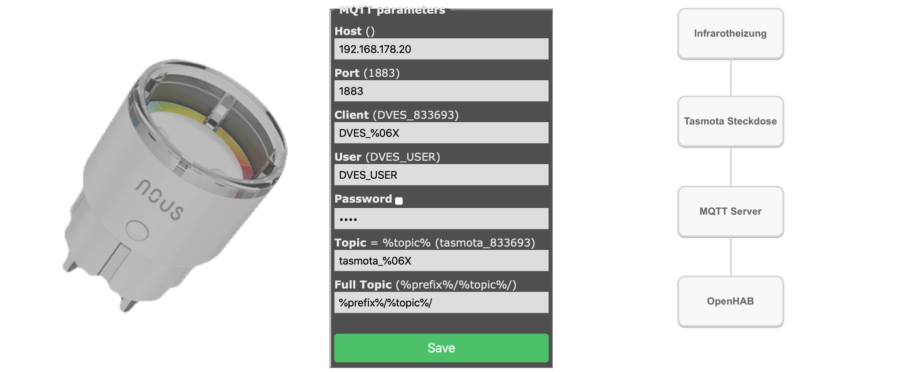
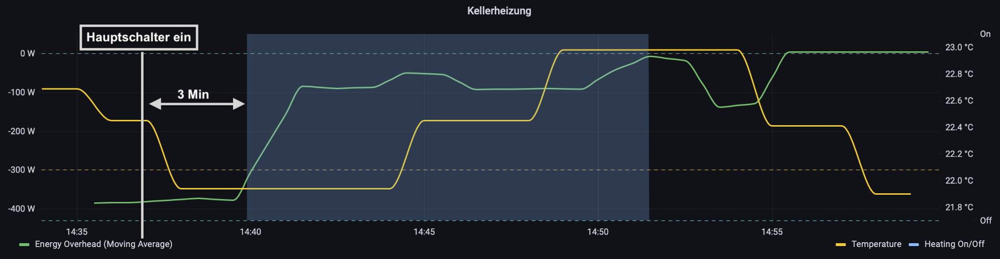

In der Übergangszeit geht der Ertrag unseres Balkonkraftwerks stark zurück.
Aber dennoch gibt es Tage, an denen wir über längere Zeit die vollen 600 Watt erreichen.
Gleichzeitig gibt es immer mehr Tage, an denen wir die Heizung einschalten müssen.
Teilweise nur, da es in meinem Arbeitszimmer im Keller zu kalt ist.
In den oberen Geschossen reicht oft die Sonneneinstrahlung, um ausreichend Wärme in den Räumen zu erreichen.
Wäre es daher nicht sinnvoll, den Energieüberschuss des Balkonkraftwerks zum Heizen des Arbeitszimmers zu nutzen?
So wäre die überschüssige Energie, für die wir keine Vergütung bekommen, gut genutzt und die Zentralheizung könnte eine Pause einlegen.

## Eine Infrarotheizung

Wir heizen aktuell leider noch mit Erdgas, hoffen aber, dass wir bald auf eine weitaus effizientere Wärmepumpe mit einem Wirkungsgrad von 300-500% umsteigen können.
Diese wäre natürlich allen anderen Wärmespendern überlegen.
Als schnelle, einfache Übergangslösung bieten sich Infrarotheizungen mit einem Wirkungsgrad von nahezu 100% an.
Niedertemperatur-Infrarotpaneele zur Wand- oder Deckenmontage mit einer Leistung von 300 W gibt es schon für 50-100€.

Im Gegensatz zu Heizlüftern und anderen Konvektionsheizungen verteilen Infrarotheizungen die Wärme über elektromagnetische Strahlung gleichmäßig im Raum.
Dabei werden Carbonheizplatten durch ein Trägermaterial aufgeheizt und geben dann Infrarot-C Strahlen mit einer Wellenlänge von 3000-10000 nm ab, was für eine schonende, behagliche Wärme sorgt.
Das initiale Aufheizen des Trägermaterials dauert ca. 5-10 Minuten.

Wir haben eine Grundlast zwischen 80-350 W.
350 W erreichen wir wenn Kühl- und Gefrierschrank gerade aktiv kühlen und 1-2 Computer laufen.
Wenn das Balkonkraftwerk 600 W produziert, bleiben somit 250-520 W ungenutzt, wenn nicht gerade gekocht oder gewaschen wird.
Eine Infrarotheizung mit 500 W würde vermutlich nur selten anspringen und durch das Takten bei schwankender Grundlast oft nicht über die Aufheizphase hinauskommen.
Ein Modell mit 100 W gibt zu wenig Wärme für den Raum ab.
Daher habe ich mich für ein Modell mit 300 W entschieden.

Finanziell lohnen sich Infrarotheizungen nur, wenn man sie mit dem ungenutzten Solarüberschuss betreibt.
Würde man den Strom vom Netz beziehen, können hohe Kosten entstehen - außer man nutzt sie nur dann wenn die Strompreise z.B. bei [Tibber](https://invite.tibber.com/q9rztnrz), niedrig oder sogar negativ sind.
Dennoch ist nicht zu vergessen, dass der CO2-Fußabdruck der Infrarotheizung vermutlich geringer als bei unserer Gasheizung ist, da aktuell im Oktober'23 62% des Stroms in Deutschland aus erneuerbaren Energien und nur 26% aus der umweltschädlicheren Kohleverstromung stammt [[Energy-Charts](https://energy-charts.info/charts/energy_pie/chart.htm?l=en&c=DE&interval=month&month=10)].

## Schritt 1: Manueller Betrieb

Im ersten Schritt habe ich die Infrarotheizung immer manuell eingeschaltet, wenn der Überschuss des Balkonkraftwerks über 300 W lag und ausgeschaltet, wenn er darunter lag.
Den aktuellen Überschuss habe ich aus meiner [Tibber](https://invite.tibber.com/q9rztnrz) App ausgelesen.
Wenn ich gerade nicht im Büro war, musste ich jedes Mal runterlaufen.
Als Informatiker konnte ich das so nicht belassen ;-)

## Schritt 2: Manuelle Fernsteuerung

Daher war Schritt 2 die Infrarotheizung an eine smarte Steckdose anzuschließen.
Nach kurzer Recherche hatte ich mich aufgrund der vielen Konfigurationsmöglichkeiten für eine Tasmota-basierte Steckdose entschieden.
Die Anbindung ins heimische Wifi verlief problemlos.
Und auch die Anbindung an meinen MQTT-Server war schnell erledigt.



Unser Smarthome basiert auf [OpenHAB](https://www.openhab.org).
Zur Anbindung der Steckdose über MQTT habe ich folgendes _Thing_ mit der ID _mqtt:topic:tasmota:tasmota_plug1_ angelegt:

```kotlin title=/etc/openhab/things/mqtt.things
Bridge mqtt:broker:myMQTTBroker "My MQTT server"
[
  host="192.168.178.20",
  clientID="myMQTTClient"
]

Thing mqtt:topic:tasmota:tasmota_plug1 "Plug1" (mqtt:broker:myMQTTBroker) [ availabilityTopic="tele/tasmota_833693/LWT", payloadAvailable="Online", payloadNotAvailable="Offline" ] {
  Channels:
    Type switch : PowerSwitch   [stateTopic="stat/tasmota_833693/POWER", commandTopic="cmnd/tasmota_833693/POWER", on="ON", off="OFF"]
    Type number : Power         [stateTopic="tele/tasmota_833693/SENSOR", transformationPattern="JSONPATH:$.ENERGY.Power"]
    Type string : RestartReason [stateTopic="tele/tasmota_833693/INFO3", transformationPattern="JSONPATH:$.Info3.RestartReason"]
    Type string : Version       [stateTopic="tele/tasmota_833693/INFO1", transformationPattern="JSONPATH:$.Info1.Version"]
    Type number : RSSI          [stateTopic="tele/tasmota_833693/STATE", transformationPattern="JSONPATH:$.Wifi.RSSI"]
    Type string : WifiDowntime  [stateTopic="tele/tasmota_833693/STATE", transformationPattern="JSONPATH:$.Wifi.Downtime"]
    Type number : LoadAvg       [stateTopic="tele/tasmota_833693/STATE", transformationPattern="JSONPATH:$.LoadAvg"]
    Type number : Uptime        [stateTopic="tele/tasmota_833693/STATE", transformationPattern="JSONPATH:$.UptimeSec"]
    Type string : Result        [stateTopic="stat/tasmota_833693/RESULT"]
}
```

Die Nummer in _tasmota_833693_ ist die ID der Steckdose, die in der Konfigurationsoberfläche mit _%06X_ eingefügt wurde.

Nun noch das entsprechende _Item_ für das _Thing_ hinzufügen:

```kotlin title=/etc/openhab/items/heating.items
Switch  HeatingSwitch  "Kellerheizung"  {channel="mqtt:topic:tasmota:tasmota_plug1:PowerSwitch", alexa="Switch"}
```

Und in der _Sitemap_ darstellen:

```kotlin title=/etc/openhab/sitemaps/home.sitemap
sitemap home label="MY Home" {
  Frame label="Heizung" {
    Default item=HeatingSwitch
  }
}
```

Nun konnte ich über die OpenHAB App oder Alexa ("_Alexa, schalte die Kellerheizung ein_") meine Infrarotheizung jederzeit bequem ein- und ausschalten.
Jedoch kam es immer wieder vor, dass meine Frau anfing zu kochen oder zu waschen und somit gar kein Überschuss des Balkonkraftwerks für die Infrarotheizung zur Verfügung stand, was ich aber viel zu spät bemerkte.

## Schritt 3: Automatischer Betrieb

Daher kam nun der dritte Schritt: die Automatisierung.

Mein Ziel war, die Heizung nur für den Zeitraum, in dem genug Überschuss, d.h. mindestens 300 W, verfügbar ist, automatisch einzuschalten.
Den aktuellen Stromverbrauch bzw. -überschuss hatte ich bereits über das [Tibber Binding](https://www.openhab.org/addons/bindings/tibber/) in OpenHAB angebunden und konnte über das _Item_ '_SmartMeterPowerDemand_' abgerufen werden.
Das _Item_ wird in einer InfluxDB persistiert, damit auch historische Werte verfügbar sind.

Zuerst implementierte ich eine einfache Regel, die die smarte Steckdose einschaltet, wenn der Strombezug unter -300 W liegt, und ausschaltet, wenn der Strombezug über 0 W liegt.
Das führte dazu, dass die smarte Steckdose beim Schleudern der Waschmaschine, Takten des Backofens oder kleinen Wolken am Himmel ständig an und wieder ausging.
Die Lösung dafür war ein Filter, der über 3 Minuten hinweg den gleitenden Mittelwert beobachtet.
Wenn der gleitende Mittelwert über 3 Minuten hinweg unter -300 W liegt, schaltet die smarte Steckdose ein, und wenn er über 3 Minuten hinweg über 0 W liegt, schaltet die smarte Steckdose aus.
Das Ganze sollte aber über einen _Hauptschalter_ gesteuert werden, da ich die Heizung nicht brauche, wenn wir nicht zuhause sind.
Daher fügte ich noch ein virtuelles _Item_ namens "_Kellerheizungsbedarf_" hinzu:

```kotlin title=/etc/openhab/items/heating.items
Switch  HeatingSwitch   "Kellerheizung"         {channel="mqtt:topic:tasmota:tasmota_plug1:PowerSwitch"}
Switch  HeatingRequest  "Kellerheizungsbedarf"
```

Den Hauptschalter musste ich natürlich auch noch in die _Sitemap_ hinzufügen:

```kotlin title=/etc/openhab/sitemaps/home.sitemap
sitemap home label="MY Home" {
  Frame label="Heizung" {
    Default item=HeatingRequest
    Default item=HeatingSwitch
  }
}
```

Und die Regel sah dann wie folgt aus:

```kotlin title=/etc/openhab/rules/heating.rules
rule "Start/stop heating"
when
  Item SmartMeterPowerDemand received update
then
  if (HeatingRequest.state == OFF && HeatingSwitch.state == ON || HeatingSwitch.state == NULL) {
    HeatingSwitch.sendCommand(OFF);
    logInfo(HeatingRequest.label, "No heating request or unknown state: stop heating");
    sendNotification("<my-account-email>", "Kellerheizung AUS");
  } else {
    var Number avgOver3Minutes = SmartMeterPowerDemand.averageSince(now.minusMinutes(3), "influxdb");

    if (HeatingRequest.state == ON && HeatingSwitch.state == OFF && avgOver3Minutes < -300) {
        HeatingSwitch.sendCommand(ON);
        logInfo(HeatingRequest.label, "Power overhead (" + avgOver3Minutes + "W): start heating");
        sendNotification("<my-account-email>", "Kellerheizung AN");
    } else if (HeatingSwitch.state == ON && avgOver3Minutes > 0) {
        HeatingSwitch.sendCommand(OFF);
        logInfo(HeatingRequest.label, "No power overhead (" + avgOver3Minutes + "W): stop heating");
        sendNotification("<my-account-email>", "Kellerheizung AUS");
    }
  }
end
```

Im nachfolgenden Bild zeigt das Verhalten in [Grafana](https://grafana.com).



---

Links:

- Foto erstellt mit DALL-E von Microsoft Designer 'Infrared heating panel mounted on a wall with a green tree painted on it. The panel is connected to a solar panel.'
- https://ig-infrarot.de/Leitfaden-IR-Heizung.pdf
- Wer wissen möchte, wie dieser Beitrag im Sourcecode aussieht, kann dies hier einsehen: [github:mroeckl/mroeckl.github.io](https://github.com/mroeckl/mroeckl.github.io/tree/master/content/posts/2023/11/05)
- Du möchtest zu Tibber wechseln, dann nutze doch meinen Einladungslink und erhalte 50€: [https://invite.tibber.com/q9rztnrz](https://invite.tibber.com/q9rztnrz)
