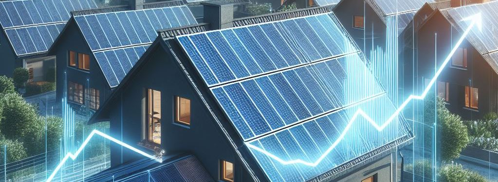

Laut [Marktstammdatenregister](https://www.marktstammdatenregister.de/MaStR/Einheit/Einheiten/OeffentlicheEinheitenuebersicht) wurden in 2023 eine Million zusätzliche Solaranlagen an Gebäuden installiert.
Inklusive der Anlagen, die nicht registriert wurden, liegt der Zubau bei weit über einer Million.
Insgesamt waren am 31.12.2023 3,6 Millionen Anlagen an Gebäuden mit einer gesamten Wechselrichterleistung von über 50 GW installiert.
Wenn dieser Trend weiter anhält, ist Deutschland auf gutem Wege, die Energiewende zum Erfolg zu führen.

Willst du wissen, wie viele PV-Anlagen in deiner Gemeinde registriert sind?
Dann gebe einfach im Eingabefeld deinen Gemeindenamen ein.
Daraufhin stellt das Diagramm die absolute Anzahl der Gebäudesolaranlagen (inkl. Balkonkraftwerke) dieser Gemeinde zum Stichtag 31. Dezember der Jahre 2021, 2022, 2023 und heute dar.
Zusätzlich kannst du dir auch noch die Summe aller Wechselrichterleistungen und Modulleistungen einblenden lassen.
Viel Spaß damit!

import SolarStats from "./SolarStats";

<SolarStats />

---

Links:

- [Filter](https://www.marktstammdatenregister.de/MaStR/Einheit/Einheiten/ErweiterteOeffentlicheEinheitenuebersicht?filter=Inbetriebnahmedatum%20der%20Einheit~lt~%2731.12.2023%27~and~Lage%20der%20Einheit~eq~%272961%27~and~Betriebs-Status~eq~%2735%27~and~Nettonennleistung%20der%20Einheit~lt~%270.601%27), der ausschließlich sich in Betrieb befindende PV-Anlagen auf Hausdach, Gebäude oder Fassade im Marktstammdatenregister anzeigt
- Foto erstellt mit Bing Image Creator: Solar panels on the roof of a house with an increasing line chart as transparent overlay
- Wer wissen möchte, wie dieser Beitrag im Sourcecode aussieht, besucht einfach [github:mroeckl/mroeckl.github.io](https://github.com/mroeckl/mroeckl.github.io/tree/master/content/posts/2024/01/07)
- [Buy me a coffee](https://www.buymeacoffee.com/mroeckl)
