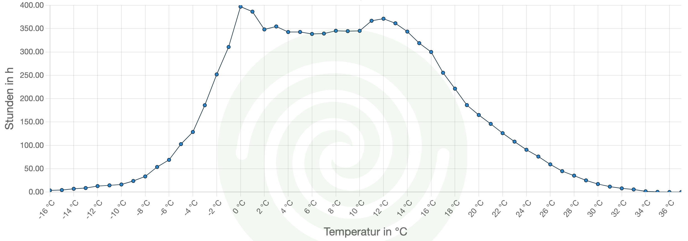

Eine der wohl wichtigsten Fragen bei der Planung einer Wärmepumpe ist: 

## Wie groß müssen wir unsere Wärmepumpe auslegen? 4, 5, 7, 9 oder noch mehr Kilowatt Heizleistung?

Gasheizungen wurden in der Regel überdimensioniert.
In unserem 120 m2 Haus wurde beispielsweise eine stark überdimensionierte 16,3 kW Gasheizung verbaut.
Würde man eine gleichstarke Wärmepumpe einbauen, hätte dies vermutlich fatale Folgen.

Aber warum ist das so?

Im Winter kann es an unserem Wohnort schon mal -20°C draußen geben.
Auch bei dieser Außentemperatur möchte drinnen niemand im Kalten sitzen.
Daher könnte man eine Wärmepumpe wählen, die auch bei -20°C noch genug Leistung aufbringen kann, um im Haus wohlige Temperaturen zu erreichen.
Doch die -20°C sind natürlich eher ein Ausnahmefall.
Die meiste Zeit des Jahres liegt die Außentemperatur wesentlich höher.
Nur 14% des Jahres hat es an unserem Wohnort Temperaturen unterhalb des Gefrierpunkts [[bwp-Klimakarte](https://www.waermepumpe.de/normen-technik/klimakarte/)].
Den Großteil der Heizperiode hat es Plusgrade und in dieser Zeit sollte die Wärmepumpe möglichst effizient laufen.

Das nachfolgende Diagramm von [bwp-Klimakarte](https://www.waermepumpe.de/normen-technik/klimakarte/) zeigt wie viele Stunden eines Jahres eine gewisse Außentemperatur an unserem Wohnort gemessen wird.
Wie man sieht, hat es den Großteil des Jahres Temperaturen zwischen 0°C und 14°C und seltener Temperaturen darunter oder darüber.

Eine Wärmepumpe, die bei -20°C noch genug Wärme produziert, braucht bei Plusgraden natürlich nur kurze Zeit, um den Heizkreis aufzuwärmen und, um das Haus nicht zu überhitzen, schaltet sie danach ab.
Daraufhin kühlt der Heizkreis wieder ab und die Wärmepumpe springt erneut an, um nach kurzer Aufheizphase wieder abzuschalten.
Das nennt man Takten und geht auf Kosten der Effizienz, da bei jedem Start des Systems Energie verloren geht und das Material unnötig beansprucht wird, so dass sich die Lebenszeit der Wärmepumpe reduziert.
Ich habe gelesen, dass ein Kompressor für ca. 50.000 Starts ausgelegt ist.
Würde der Kompressor alle 10 Minuten für kurze Zeit starten, so würde er bereits nach einem Jahr diese kritische Marke erreichen.
Ziel ist es daher, dass der Kompressor so lange wie möglich ohne unnötige Starts durchläuft.

Um dem Takten entgegenzuwirken, haben moderne Wärmepumpen eine so genannte Invertersteuerung, die die Drehzahl des Kompressors bis zu einem gewissen Grad dem Bedarf anpassen kann.
Wird also weniger Wärme benötigt, so regelt die Invertersteuerung die Drehzahl nach unten, wodurch weniger Wärme erzeugt und somit das Takten verhindert wird.
Doch die Invertersteuerung kann nicht beliebig weit nach unten modulieren und irgendwann ist das untere Limit erreicht und die Wärmepumpe muss takten.
Außerdem laufen die Wärmepumpen im unteren Grenzbereich oft ineffizienter.
Unsere Wärmepumpe läuft am effizientesten bei ca. 60% Modulation.

Aber was passiert, wenn die obere Leistungsgrenze erreicht ist? Dann wird bei so genannten bivalenten, monoenergetischen Wärmepumpen ein elektrischer Zuheizer zugeschaltet, der die Wärmepumpe unterstützt. Dieser ist zwar sehr viel ineffizienter, aber solange es nur um einige Tage im Jahr geht, ist es über das ganze Jahr hinweg betrachtet dennoch gewinnbringend, da die Wärmepumpe den Großteil des Jahres dafür im optimalen Bereich laufen kann.

## Wie bestimmt man nun diesen Übergangsbereich, ab dem die Wärmepumpe vom elektrischen Zuheizer unterstützt wird?

Hierzu müssen wir die Heizlast des Gebäudes bestimmen.
Laut [Wikipedia](https://de.wikipedia.org/wiki/Heizlast) versteht man unter **Heizlast** "_die zum Aufrechterhalt einer bestimmten Raumtemperatur notwendige Wärmezufuhr_".

Methoden zur Bestimmung der Heizlast sind in **EN 12831** definiert.
Am genauesten gelingt die Heizlastbestimmung mit einer exakten Baubeschreibung.
Leider haben wir die nicht für unser Haus.
Glücklicherweise bietet das Beiblatt 2 zu EN 12831 Abhilfe.
Hierin werden zwei vereinfachte Verfahren definiert:

### Berechnungsverfahren anhand Verbrauchswerten

Anhand des Gas-/Ölverbrauchs der letzten Jahre, sowie Informationen zum Wohnort, Haus und Personen im Haushalt kann die Heizlast näherungsweise berechnet werden.
Tools von [Stiebel Eltron](https://www.stiebel-eltron.de/toolbox/heizlast/) oder [Bosch](https://bosch-de-heatpump.thernovo.com/) ergeben eine Heizlast unseres Hauses von 4,6-4,8 kW.
Dieser Wert bezieht sich auf die so genannte **Normaußentemperatur**, also die tiefste Temperatur, sie sich 10 Mal innerhalb von 20 Jahren über einen Zeitraum von mindestens zwei aufeinanderfolgenden Tagen gehalten hat.
Die Normaußentemperatur kann beim [Bundesverband Wärmepumpe (BWP)](https://www.waermepumpe.de/normen-technik/klimakarte/) nachgeschlagen werden.
Unsere Normaußentemperatur liegt bei -13,6 °C.

### Grafisches Verfahren
Alternativ (oder zum Vergleich) kann man auch ein grafisches Verfahren anwenden. Zur Ermittlung der Heizkurve haben wir den Gasverbrauch am Zähler über einige Wochen hinweg, in denen es wärmere aber auch Tage mit recht kalten Temperaturen gab, aufgeschrieben.

| Datum | Zählerstand [m3] | &osol; Feuerungsleistung [kW] | &osol; Außentemperatur [°C]|
| ----- | ---- | ----------- | --- |
| 31.12.2022 17:39 | 6437,495 |  | 
| 01.01.2023 08:44 | 6440,013 | 1,71 | 6
| 01.01.2023 18:59 | 6441,129 | 1,12 | 8
| 02.01.2023 09:24 | 6443,658 | 1,80 | 2

Die durchschnittliche Feuerungsleistung in der 3. Spalte kann man mit folgender Formel in Excel berechnen:

`=(B2-B1)/((A2-A1)*24)*10,259`

Der Heizwert von Erdgas (10,259kWh/m3) war auf unserer Gaskostenabrechnung zu finden.

Die Feuerungsleistung haben wir dann in einem Diagramm über die Außentemperatur dargestellt und die Trendlinie (orange) von Excel berechnen lassen.
Die Trendlinie stellt den mittleren Wärmeenergiebedarf über die Außentemperatur dar.
Unser Haus wird jedoch nicht nur durch Gas erwärmt, sondern auch die Sonne wie auch Geräte und Menschen geben Wärme ab, die in der Trendlinie noch nicht erfasst sind.

Um schließlich die Gebäudeheizlast (auch als **Gebäudekennlinie** bekannt) zu bestimmen, muss die Trendlinie noch so weit nach rechts verschoben werden, bis sie die gewünschte Rauminnentemperatur (Raumsolltemperatur) auf der x-Achse schneidet.
Bei uns sind das 20 °C.
Daraus ergibt sich nun die Gebäudeheizlast ohne Fremdwärmeeinfluss (gestrichtelte orange Linie).
Danach muss die Linie noch mit dem Wirkungsgrad der Gasheizung multipliziert werden.
In unserem Fall ergibt sich durch den Wirkungsgrad von 85% unserer alten Gasheizung die durchgezogene schwarze Linie, die so genannte Gebäudekennlinie, und eine Heizlast von ca. 4,7 kW an der Normaußentemperatur bei -13,6°C.
Beide Verfahren kommen somit auf ähnliche Ergebnisse: 4,6-4,8 und 4,7 kW.

## Und was bedeutet das für die Auswahl der richtigen Wärmepumpe?

Für nahezu jede Wärmepumpe gibt es Angaben zur elektrischen Leistungsaufnahme, sowie der daraus erzeugten Heizleistung.
Oft findet man Angaben wie sie hier von Bosch für die 4kW Anlage (4 OR-S) und die 5kW Anlage (5 OR-S) zu sehen sind:

| Einstufung gemäß EN 14511          | Einheit | 4 OR-S | 5 OR-S |
| ---------------------------------- | ------- | ------ | ------ |
| Max. Leistungsabgabe bei A -10/W35 | kW      | 3,63   | 5,45   |
| Max. Leistungsabgabe bei A -7/W35  | kW      | 3,92   | 5,42   |
| Max. Leistungsabgabe bei A +2/W35  | kW      | 4,31   | 6,43   |

Das A-10/W35 bedeutet, dass bei einer Außentemperatur von -10°C das Wasser auf 35°C aufgewärmt wird.
Unsere Fußbodenheizung erreicht nur selten über 35°C im Vorlauf.
Die Werte passen daher gut für unsere Berechnung.
Dazu tragen wir nun die Leistungsabgabewerte in eine Diagramm über die Außentemperatur ein und übertragen noch unsere Gebäudekennlinie, die wir im vorigen Schritt bestimmt haben.
Das Ergebnis seht ihr in Bild oben auf der rechten Seite.

Neben der maximalen Leistungsabgabe findet man oft auch Informationen zur minimalen Leistungsabgabe, die man noch dazu ins Diagramm eintragen kann.
Die minimale Leistungsabgabe ist bei der Bosch 4 OR-S und 5 OR-S gleich und im Diagramm oben gestrichelt dargestellt.

Der Punkt, an dem die Gebäudekennlinie die Heizleistung der Wärmepumpe schneidet, ist der so genannte **Bivalenzpunkt**.
Er sollte bei ca. -5°C liegen [[Bosch](https://www.heizungsdiscount24.de/pdf/Junkers-Bosch-Compress-CS7000iAW-3-13-kW-Planungsunterlage.pdf?srsltid=AfmBOorAZHwu8NDEMCaV3dY5Eoxt7voabOWr4X0S_GaFbXJ8AyQmnuYU)].
Bei der größeren 5 OR-S liegt er bei -15 °C.
Diese Wärmepumpe ist somit etwas zu groß für uns.
Bei der 4 OR-S liegt er bei -8°C.
Diese Wärmepumpe passt daher besser zu uns.

## Und was bedeutet das nun genau?

Lasst uns das Diagramm für die 4 OR-S nochmal etwas genauer analysieren:

* Bei -8°C schneidet die Gebäudekennlinie die max. Heizleistung, dem so genannten **Bivalenzpunkt**.
Die Wärmepumpe kann am Bivalenzpunkt noch etwa 3,8 kW Heizleistung erbringen.
Sobald es noch kälter wird, muss der elektrischer Zuheizer unterstützen, um die nötige Heizlast bereitzustellen.
Bei der Normaußentemperatur bei 13,6°C leistet die Wärmepumpe &frac23; der Heizleistung und der Zuheizer &frac13;.
Der Bereich, in dem der Zuheizer unterstützen muss, ist im Diagramm orange schraffiert.

* Wird es wärmer kann die Wärmepumpe ihre Heizleistung mit der Invertersteuerung drosseln, um die Heizleistung der Gebäudekennlinie anzupassen.
Doch ist dies nur bis zur min. Heizleistung möglich.
Bei +8°C schneidet die Gebäudekennlinie die min. Heizleistung.
Ab +8°C wird die Wärmepumpe mit dem Takten beginnen müssen.
Jedoch nur bis ca. 15°C, unserer **Heizgrenztemperatur**, bei der wir in der Regel nicht mehr heizen müssen.

* Im Hintergrund ist noch die Dichtefunktion der Außentemperatur zu erkennen.
Man sieht, dass Temperaturen links vom Bivalenzpunkt nur selten vorherrschen (ca. 130h).
Bei dieser Bivalenztemperatur ergibt sich, gemäß
DIN 4701 Teil 10, eine Deckungsrate der Wärmepumpe
an der Heizarbeit von ca. 99 %.
Lediglich 1 % muss noch vom Zuheizer beigesteuert
werden [[Bosch](https://www.heizungsdiscount24.de/pdf/Junkers-Bosch-Compress-CS7000iAW-3-13-kW-Planungsunterlage.pdf?srsltid=AfmBOorAZHwu8NDEMCaV3dY5Eoxt7voabOWr4X0S_GaFbXJ8AyQmnuYU)].

Nach dieser ausführlichen Analyse haben wir uns für die Bosch AW 4 OR-S entschieden und erwarten eine effiziente, kostengünstige und langlebige Arbeitsweise unserer Wärmepumpe.

---

Links:

- [IHZ Heizlastberechnung](https://www.ikz.de/uploads/media/022.pdf)
- Wer wissen möchte, wie dieser Beitrag im Sourcecode aussieht, besucht einfach [github:mroeckl/mroeckl.github.io](https://github.com/mroeckl/mroeckl.github.io/tree/master/content/posts/2024/02/17)
- [Buy me a coffee](https://www.buymeacoffee.com/mroeckl)
