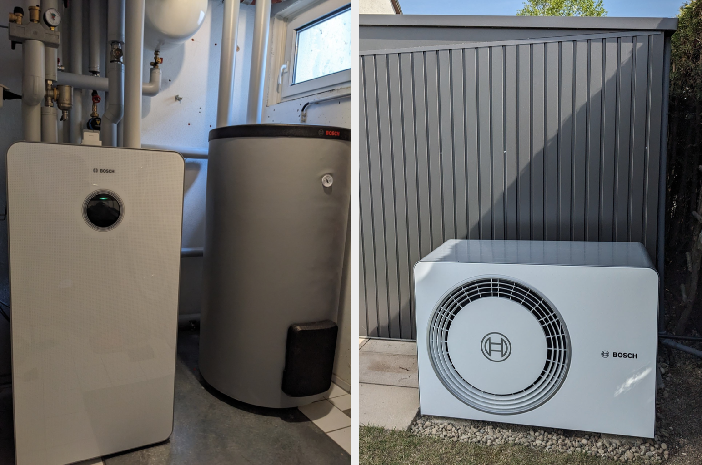
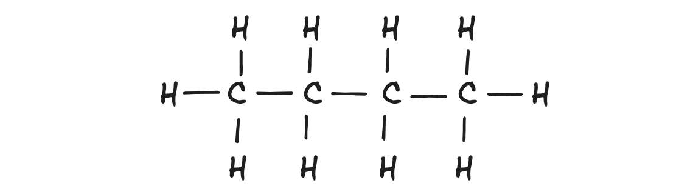
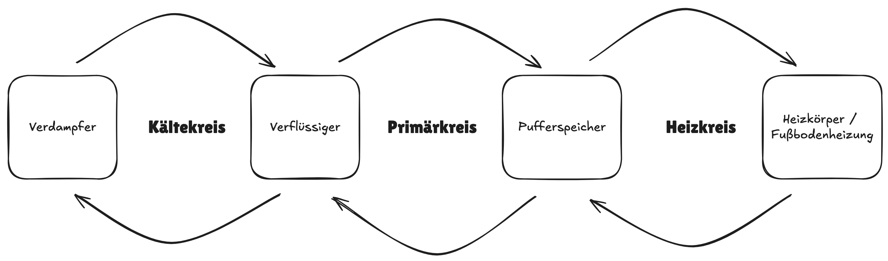
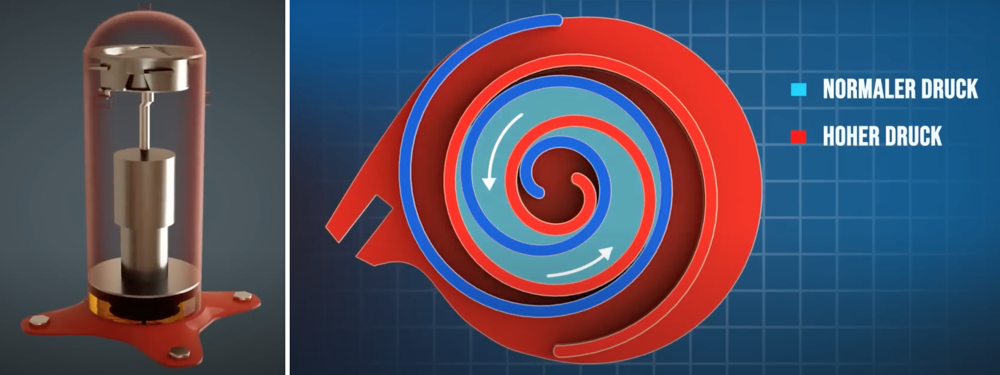

Seit diesem Jahr sind wir stolzer Besitzer einer Bosch Compress 6800i AW 12 MB mit einer AW 4 OR-S.

## Luft/Wasser-Wärmepumpe

Hinter diesem kryptischen Namen verbirgt sich eine Wärmepumpe, genauer gesagt eine Luft/Wasser-Wärmepumpe, was auch am Kürzel *AW* für *Air/Water* erkennbar ist.
Luft/Wasser bedeutet in diesem Zusammenhang, dass der Umgebungsluft Wärme entzogen und damit Wasser erwärmt wird.
Alternativen sind Luft/Luft-Wärmepumpen (Klimaanlagen), die ebenso Luft als Umweltwärme einsetzen, damit aber Luft statt Wasser erwärmen.
Sole/Wasser-Wärmepumpen nutzen Sole, die aus dem Erdreich Umweltwärme aufnimmt und damit Wasser erwärmt.
Wasser/Wasser-Wärmepumpen nutzen als Umweltwärme das Grundwasser.

Die CS 6800i AW gibt es in 3 verschiedenen Ausführungen:

- CS 6800i AW 12 MB: bodenstehend mit 70l Pufferspeicher
- CS 6800i AW 12 M: bodenstehend mit 16l Pufferspeicher und 180l Warmwasserspeicher
- CS 6800i AW 12 E: wandhängend ohne Speicher

Da wir in einem 4-Personen-Haushalt leben, reicht der eingebaute 180l Warmwasserspeicher der CS 6800i AW 12 M nicht aus.
Daher haben wir uns für die Variante CS 6800i AW 12 MB ohne Warmwasserspeicher aber mit eingebautem Pufferspeicher entschieden.
Zusätzlich kam ein externer 290l Warmwasserspeicher hinzu.

## Kältemittel

Als Kältemittel nutzt unsere Wärmepumpe R290.
R290 ist auch als Propan bekannt.
Es wird in Gasfeuerzeugen und -grills eingesetzt und ist hoch entzündlich, da es sich um Kohlenwasserstoff handelt.
Die Dichte von Propan ist höher als die der Luft.
Propan ist somit schwerer als Luft und steigt daher nicht auf, sondern bleibt auf dem Boden oder sinkt weiter in etwaige Senken, sollte es dem Kältekreis entweichen.
Der Kältekreis sollte sich deshalb nicht in unmittelbare Umgebung von Lichtschächten, Türen, Fenstern oder innerhalb des Hauses befinden.

Dennoch hat Propan einen großen Vorteil im Vergleich zu herkömmlichen Kältemitteln wie R410A oder R32.
Es ist nämlich weit weniger umweltschädlich und ungiftig.
R290 hat einen niedrigen GWP-Index von 3, während R32 einen GWP-Index von 675 und R410A sogar einen Wert von 2088 hat.
Ab 2027 dürfen keine Anlagen mit einem GWP-Index größer 150 mehr verbaut werden.
Der GWP-Index (Global Warming Potential) gibt an, wie stark eine Substanz über 100 Jahre verglichen mit CO2 als Treibhausgas wirkt.
Die Zukunft liegt klar auf R290, da es nicht nur umweltfreundlicher, sondern auch mit niedrigerem Verflüssigungsdruck arbeiten kann und somit die Lebensdauer des Kompressors erhöht, und daher war für uns die Entscheidung klar für R290.

- Verdampfungstemperatur bei 1 bar: -42,1 °C
- Kondensationstemperatur: 36,7 °C

## Außeneinheit und Inneneinheit

Die meisten Luft-Wasser-Wärmepumpen bestehen aus 2 Komponenten: der Inneneinheit und der Außeneinheit.
In unserer Außeneinheit befindet sich der komplette Kältekreislauf, inkl. Verdichter, Verdampfer, Verflüssiger und Expansionsventil.
Man spricht hierbei auch von einem Monoblock.
Im Gegensatz dazu verläuft bei einer Wärmepumpe in Split-Bauweise der Kältekreis zwischen Außen- und Inneneinheit.
R290-Wärmepumpen in Split-Bauweise sind aufgrund der Sicherheitsvorschriften eher selten.
Bei einem Monoblock wird im Verflüssiger die Wärme des Kältemittels direkt an das Wasser abgeben, das in der Heizungsanlage genutzt wird bzw. im Warmwasserspeicher das Brauchwasser erwärmt.
Da Wasser bei 0°C gefriert, muss die Leitung speziell im Außenbereich gut isoliert und frostfrei ca. 70cm tief im Boden verlaufen.
Bei uns wurde zur Isolation im Außenbereich eine Fernwärmeleitung verwendet.

## Primärkreis, Heizkreis und Pufferspeicher

Bei Monoblock-Anlagen unterscheidet man neben dem Kältekreis, der vollständig in der Außeneinheit abläuft, zwei weitere Kreise: Primärkreis und Heizkreis.
Der Primärkreis verläuft zwischen Außeneinheit und Inneneinheit.
Der Heizkreis speist die Heizkörper oder Fußbodenheizung.
Zwischen Primärkreis und Heizkreis wird in der Regel ein Pufferspeicher verbaut.
Der Pufferspeicher unserer CS 6800i AW 12 MB hat ein Fassungsvermögen von 70l.

Der Pufferspeicher dient als:

- Entkopplung zwischen Primärkreis und Heizkreis, wenn beide unterschiedliche Volumenströme aufweisen, und als
- Wärmespeicher zum Abtauen.

In der CS 6800i AW 12 MB ist ein Parallelpuffer mit Stichanbindung verbaut, d.h. der Pufferspeicher ist über ein T-Stück eingebunden und im optimalen Fall strömt das Wasser von Primärkreis zum Heizkreis ohne die Abzweigung zum Pufferspeicher zu nutzen.
Genutzt würde sie, wenn entweder:

1. der Primärkreis einen _höheren_ Volumenstrom aufweist als der Heizkreis abnehmen kann - dann zieht der Primärkreis warmes Wasser wieder direkt in den Rücklauf und die Wärmepumpe geht aus - oder
2. der Primärkreis einen _niedrigeren_ Volumenstrom aufbringt als der Heizkreis abnimmt - dann befördert der Heizkreis kälteres Wasser aus seinem Rücklauf direkt wieder in seinen Vorlauf.

Stellt sich die Frage, woher die unterschiedlichen Volumenströme kommen.
Dazu muss man die Regelung der Kreise etwas genauer betrachten.
Im Primärkreis wird als Zielgröße die Temperaturdifferenz _dT_ zwischen Vor- und Rücklauf, die so genannte Spreizung, eingestellt.
Das Erreichen der Spreizung wird über den Volumenstrom geregelt.
Ist die Spreizung zu niedrig, wird der Volumenstrom erhöht.
Ist sie zu hoch, wird der Volumenstrom reduziert.

Im Heizkreis hingegen wird der Differenzdruck eingestellt und die Spreizung ergibt sich aus der Wärmeabnahme der Heizkörper bzw. Fußbodenheizung.
Bei gleichbleibendem Differenzdruck nimmt das Haus immer gleich viel Energie ab und die Spreizung bleibt auf nahezu dem selben Wert.
Leichte Veränderungen ergeben sich bei niedrigerer Außentemperatur durch die steigende Vorlauftemperatur.
Dies Veränderung kann aber vernachlässigt werden.

Standardmäßig ist bei der Bosch CS 6800i AW die Spreizung des Primärkreises auf 4,5K bei Fußbodenheizung und 7,5K bei Heizkörpern und ein Differenzdruck von 250 mbar hinterlegt.

Grundsätzlich ist eine niedrigere Spreizung effizienter, denn um beispielsweise eine mittlere Temperatur von 30° zu erreichen, muss die Spreizung bei 4K den Vorlauf auf 32° erwärmt werden.
Bei einer Spreizung von 8K müsste der Vorlauf auf 34° erwärmen.
Grobe Faustregel: je Grad reduziert sich der Energieverbrauch um ca. 2,5% [[Quelle](https://www.heizungsdiscount24.de/pdf/Junkers-Bosch-Compress-CS7000iAW-3-13-kW-Planungsunterlage.pdf)]

## Leistungsadaption

Je nach Außentemperatur wird unterschiedlich viel Wärmeenergie benötigt.
Alte Wärmepumpen und Kühlschränke steuern dies über simples Takten.
D.h. sie gehen aus, wenn genug Wärme/Kälte produziert wurde und gehen wieder an, wenn der Wärme-/Kältebedarf wieder steigt.
Dieses Verhalten erhöht einerseits den Verschleiß und andererseits ist es ineffizient, da Systemkomponenten abkühlen und erneut erwärmt werden müssen.

Moderne Wärmepumpen, wie die Bosch AW OR-S, kann die Wärmeproduktion dem Bedarf anpassen.
Dafür kommt ein Frequenzumrichter, auch bekannt als Wechselrichter oder Inverter, zum Einsatz.
Der Inverter wandelt den 50-Hz Wechselstrom in Gleichstrom und dann wieder in Wechselstrom mit einer Frequenz zwischen 30-90 Hz.
Daraus ergibt sich bei bei unserer AW 4 OR-S eine elektrische Leistungsaufnahme von 0,3-1,7 kW.
Und bei 2° Außentemperatur und einer Vorlauftemperatur von 35°C (A2/W35) erzeugt die Wärmepumpe aus der eingesetzten elektrischen Energie dann zwischen 1,8-4,3 kW Wärmeenergie.
Im niedrigeren Arbeitsbereich ist jedoch die Effizienz etwas geringer.
Die höchste Effizienz erreicht die Wärmepumpe bei ca. 60% der Maximalleistung.

Die Frequenz des Wechselstroms regelt die Umdrehungszahl des eingebauten Scrollverdichters.
Durch die Rotation des Scrollverdichters wird das Kältemittel komprimiert.
Der Druck nimmt zu je weiter das Kältemittel ins Zentrum des Scrollverdichters gelangt.
Durch den erhöhten Druck steigt die Temperatur des Kältemittels.

## Effizienz

In den nächsten Monaten werden wir uns die Effizienz der Wärmepumpe etwas genauer anschauen und den Blog-Post entsprechend erweitern.

---

Links:

- [Bilder/Video zum Scrollverdichter](https://www.youtube.com/watch?v=oM3zJeGfpys)
- Wer wissen möchte, wie dieser Beitrag im Sourcecode aussieht, besucht einfach [github:mroeckl/mroeckl.github.io](https://github.com/mroeckl/mroeckl.github.io/tree/master/content/posts/2024/01/07)
- [Buy me a coffee](https://www.buymeacoffee.com/mroeckl)
