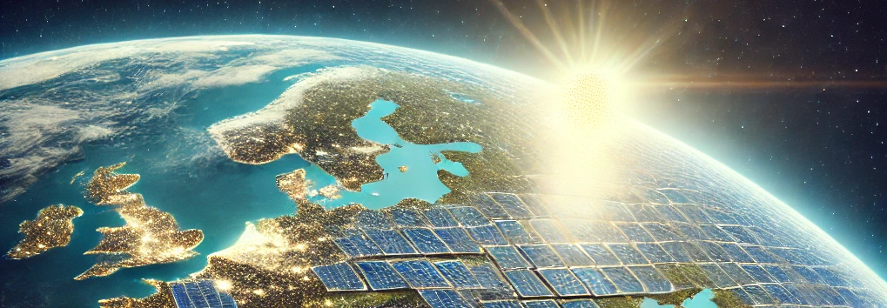

Die Anzahl der Balkonkraftwerke in Deutschland hat in den letzten Jahren rasant zugenommen.
In der nachfolgenden Deutschlandkarte könnt ihr sehen, wie viele Balkonkraftwerke je Bundesland im Marktstammdatenregister aktuell registriert sind.
Für einen fairen Vergleich muss man aber die registrierten Balkonkraftwerke in Relation zur Anzahl der Haushalte betrachten, denn Nordrhein-Westfalen hat 25-mal mehr Haushalte als Bremen - also vermutlich auch 25-mal Balkone.
Die Einfärbung zeigt daher die durchschnittliche Anzahl der registrierten Balkonkraftwerke je 1000 Haushalte.

import BalconysolarGeoStats from "./BalconysolarGeoStats";

<BalconysolarGeoStats />

---

Links:

- [Marktstammdatenregister](https://www.marktstammdatenregister.de/MaStR/Einheit/Einheiten/OeffentlicheEinheitenuebersicht)
- Haushalte pro Bundesland von [Destatis](https://www.destatis.de/DE/Themen/Gesellschaft-Umwelt/Bevoelkerung/Haushalte-Familien/Tabellen/1-2-privathaushalte-bundeslaender.html)
- Wer wissen möchte, wie dieser Beitrag im Sourcecode aussieht, besucht einfach [github:mroeckl/mroeckl.github.io](https://github.com/mroeckl/mroeckl.github.io/tree/master/content/posts/2023/10/06)
- [Buy me a coffee](https://www.buymeacoffee.com/mroeckl)
